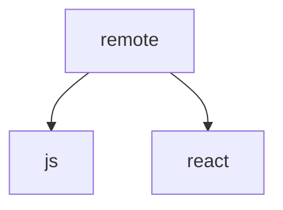

# microfrontend
micro frontend sample

# 使用ライブラリ

| Name | Description | FYI |
| --- | --- | --- |
| Module Federation | 複数の個別のビルドによって単一のアプリケーションを構築するWebpackのコアプラグイン | [webpack](https://webpack.js.org/concepts/module-federation/) |
| solid JS | インタラクティブな Web アプリケーションを作成するための JavaScript フレームワーク | [soild-js](https://www.solidjs.com/guides/getting-started) |


# サンプルApp作成

1. remote solid-js app 作成
```
npx create-mf-app
? Pick the name of your app: remote
? Project Type: Application
? Port number: 3000
? Framework: solid-js

cd remote
yarn
yarn start
```

2. 一般 jsx app 作成
```
npx create-mf-app
? Pick the name of your app: host
? Project Type: Application
? Port number: 8080
? Framework: solid-js

cd host
yarn
yarn start
```

2. react app 作成
```
npx create-mf-app
? Pick the name of your app: react-host
? Project Type: Application
? Port number: 3001
? Framework: react

cd react-host
yarn
yarn start
```


構成


